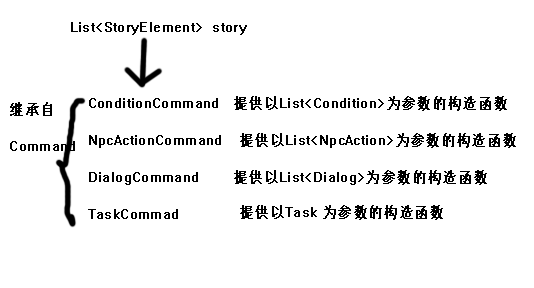

# StorySystem剧情系统
* StorySystem是这个ARPG游戏项目最重要的一个系统  
他讲负责执行游戏剧情，控制剧情进度：  
例如等待主角触发某个剧情，执行一段对话，对NPC执行一段行为控制  
* 因此我设计了四大系统  
*     DialogSystem（对话系统)  
*     NpcActionSystem(角色行动控制系统)  
*     ConditionSystem（条件判定系统）
*     TaskSystem（任务系统）    
  
  四大系统负责具体某段剧情元素的执行，四大系统是剧情系统执行的根基  
  例如：DialogSystem提供了一个public的接口函数

      public IEnumerator EnterDialog(DialogCommand dialogCommand)    
       
       {    
          DialogUI.SetActive(true);  
          hidenUI.SetActive(false);
          GameObject.Find("Player").GetComponent<PlayerControl>().CommandPlayerIdle();
          yield return  0;
          yield return StartCoroutine(enterDialog(dialogCommand));
          DialogUI.SetActive(false);
          hidenUI.SetActive(true);
          yield return 0;
      }     
      

注意：这四大系统都继承于MonoBehaviour，这意味着他们不能手动实例化，必须绑定在一个GameObject上才能使用，  
我将这四个系统和StoryManage都绑定在一个空的GameObject（叫做GameManage）上了，可以看到，这个函数需要一个DialogCommand的参数来执行  
同时这个函数也是一个协程执行的，子系统的先说到这里，待会有用    
  
  
* StoryManage  

StoryManage是一个最终要的类，他读取了xml中的数据并整理好存入对应自定义的数据结构中  
然后在Start()函数中执行协程，从此之后，游戏剧情就开始了！协程会一直执行！  
如果ConditionList不满足，剧情会等待在那里，玩家可以自主控制Player，知道Condition满足为止    

        public void ReadStoryFormFile()
        {
            Command command = new Command();
            XmlDocument xmlDoc = new XmlDocument();
            xmlDoc.LoadXml(story.text);
            XmlNodeList storyElementList = xmlDoc.SelectSingleNode("/Story").ChildNodes;
            foreach (XmlNode _storyElement in storyElementList)
        {
            StoryElement storyElement = new StoryElement();
            XmlNode conditionListNode = _storyElement.SelectSingleNode("ConditionList");
            XmlNode TaskNode = _storyElement.SelectSingleNode("Task");
            XmlNode dialogListNode = _storyElement.SelectSingleNode("DialogList");
            XmlNode npcActionListNode = _storyElement.SelectSingleNode("NpcActionList");
         
           if (conditionListNode != null)
            {
                List<Condition> ConditionList;
                ConditionList = ReadConditionList(conditionListNode);
                ConditionCommand conditionCommand = new ConditionCommand(ConditionList);
                storyElement.commandList.Add(conditionCommand);
            }
            if (dialogListNode != null)
            {
                List<Dialog> DialogList;
                DialogList = ReadDialogList(dialogListNode);
                DialogCommand dialogCommand = new DialogCommand(DialogList);
                storyElement.commandList.Add(dialogCommand);
            }
            if (npcActionListNode != null)
            {
                List<NpcAction> NpcActionList;
                NpcActionList = ReadNpcActionList(npcActionListNode);
                NpcActionCommand npcActionCommand = new NpcActionCommand(NpcActionList);
                storyElement.commandList.Add(npcActionCommand);
            }
            if (TaskNode != null)
            {
                Task task;
                task = ReadTask(TaskNode);
                TaskCommand taskCommand = new TaskCommand(task);
                storyElement.commandList.Add(taskCommand);
            }
            storyList.Add(storyElement);
        }
    }  
    
   这里的数据结构关系可能会比较复杂，所有在StoryList表中的数据结构都存储在PlayerState.cs中，我在这里给出一张图  
   非常直白
   
